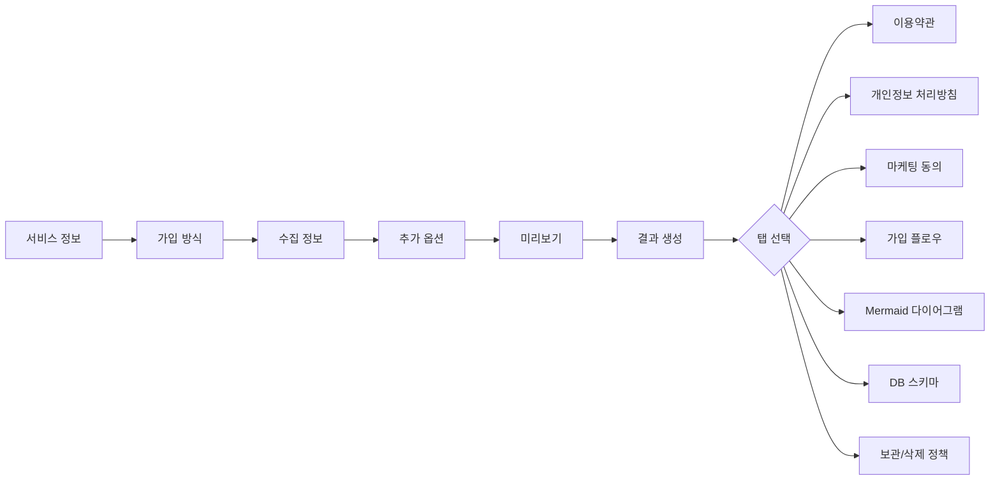
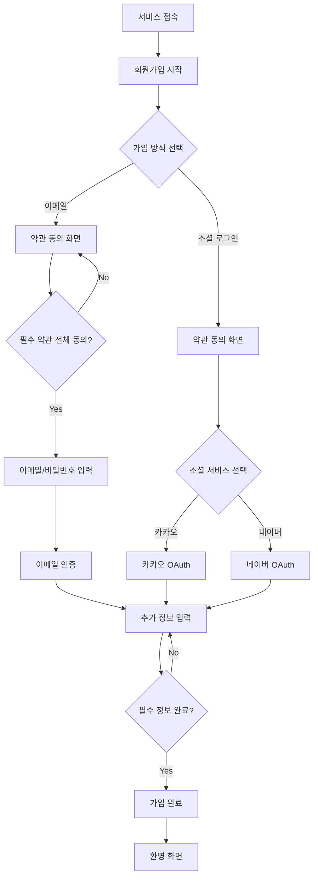

# JoinKit - 전체 서비스 설계 문서

> 약관 생성기 + 회원가입 플로우 설계기 + DB 스키마 생성기

---

## 1. 서비스 개요

### 서비스명: JoinKit (회원가입 스타터 키트)

| 항목 | 내용 |
|------|------|
| 목적 | 키워드 입력만으로 약관·플로우·DB 스키마를 한 번에 생성 |
| 포지션 | "법률 자문"이 아닌 "초안 생성 도구" |
| 타겟 | 1인 개발자, 스타트업, 외주 개발자 |
| 핵심 가치 | MVP 출시까지의 회원가입 관련 작업 시간을 90% 단축 |

---

## 2. 화면 구조 (페이지 단위)

```
/ (메인 - 위자드)
├── Step 1: 서비스 정보 입력
├── Step 2: 가입 방식 선택
├── Step 3: 수집 정보 선택
├── Step 4: 추가 옵션 설정
├── Step 5: 미리보기 & 확인
└── Step 6: 결과 (탭 전환)
    ├── 이용약관
    ├── 개인정보 처리방침
    ├── 마케팅 동의 (선택)
    ├── 가입 플로우
    ├── 플로우 다이어그램 (Mermaid)
    ├── DB 스키마 (SQL)
    └── 보관/삭제 정책
```

---

## 3. UX 흐름 설명

### Step 1: 서비스 정보 입력
- 서비스 이름, 회사명, URL(선택), 서비스 유형 선택
- 한 화면에 한 그룹의 정보를 입력
- 서비스 유형은 카드형 선택 (아이콘 + 설명 포함)

### Step 2: 가입 방식 선택
- 이메일 / 휴대폰 / 소셜(카카오, 네이버, 구글, Apple) 중 복수 선택
- Chip Toggle 형태로 직관적 선택
- 최소 1개 이상 필수

### Step 3: 수집 정보 선택
- 이메일, 전화, 이름, 닉네임, 생년월일, 성별, 주소, 결제정보, 프로필 이미지
- 각 항목별 설명 + 토글 형태
- 하단에 "개인정보 최소 수집 원칙" 안내

### Step 4: 추가 옵션
- 마케팅 수신 동의 (선택)
- 미성년자 대상 여부
- 결제 기능 포함 여부
- 제3자 정보 제공 여부
- Toggle 형태로 설정

### Step 5: 미리보기
- 입력한 모든 정보를 카드 형태로 요약
- "이 내용으로 생성합니다" 확인
- 법적 면책 고지 표시

### Step 6: 결과
- 탭 네비게이션으로 각 결과물 전환
- 전체 다운로드 (TXT) 기능
- SQL 복사 기능
- Mermaid 코드 복사 기능
- "새로 만들기" 버튼

---

## 4. Mermaid 플로우 다이어그램

### 위자드 플로우


### 회원가입 플로우 (생성 예시)


---

## 5. Web/App 공용 컴포넌트 구조

```
src/
├── components/
│   ├── ui/                    # 공용 디자인 시스템
│   │   ├── Button.tsx         # 버튼 (primary/secondary/ghost/danger)
│   │   ├── Card.tsx           # 카드 컨테이너
│   │   ├── Checkbox.tsx       # 체크박스 (약관 동의용)
│   │   ├── ChipToggle.tsx     # 칩 토글 (다중 선택)
│   │   ├── SelectCard.tsx     # 카드형 라디오 선택
│   │   ├── ProgressBar.tsx    # 진행률 표시
│   │   ├── Toggle.tsx         # 토글 스위치
│   │   ├── CodeBlock.tsx      # 코드 블록 (SQL 표시)
│   │   └── MarkdownPreview.tsx # 마크다운 렌더러 (약관 표시)
│   │
│   ├── layout/                # 레이아웃
│   │   ├── Header.tsx         # 상단 헤더
│   │   └── Footer.tsx         # 하단 푸터
│   │
│   ├── steps/                 # 위자드 각 단계
│   │   ├── StepServiceInfo.tsx
│   │   ├── StepAuthMethod.tsx
│   │   ├── StepCollectInfo.tsx
│   │   ├── StepOptions.tsx
│   │   ├── StepPreview.tsx
│   │   └── StepResult.tsx
│   │
│   └── Wizard.tsx             # 위자드 컨트롤러
│
├── lib/                       # 비즈니스 로직
│   ├── cn.ts                  # className 유틸리티
│   ├── generateTerms.ts       # 약관 생성 엔진
│   ├── generateFlow.ts        # 플로우 생성 엔진
│   ├── generateSchema.ts      # DB 스키마 생성 엔진
│   └── generateAll.ts         # 통합 생성 함수
│
├── store/
│   └── useJoinKitStore.ts     # Zustand 전역 상태
│
├── types/
│   └── index.ts               # TypeScript 타입 정의
│
└── app/                       # Next.js App Router
    ├── layout.tsx
    ├── page.tsx
    └── globals.css
```

### React Native (Expo) 공유 전략

```
shared/                        # 웹/앱 공유 코드
├── lib/                       # 생성 로직 100% 공유
│   ├── generateTerms.ts
│   ├── generateFlow.ts
│   └── generateSchema.ts
├── types/                     # 타입 100% 공유
│   └── index.ts
└── store/                     # 상태 관리 100% 공유
    └── useJoinKitStore.ts

mobile/                        # React Native 전용
├── components/                # RN 컴포넌트 (별도 구현)
│   ├── ui/
│   └── steps/
└── navigation/                # React Navigation
```

**공유 가능 비율**: 비즈니스 로직 100%, 타입 100%, 상태 관리 100%, UI 컴포넌트 0% (플랫폼별 구현)

---

## 6. 디자인 시스템 스펙

### 컬러
| 토큰 | 값 | 용도 |
|------|-----|------|
| primary-500 | #3182F6 | 메인 액션 |
| primary-50 | #EBF2FE | 선택 상태 배경 |
| gray-900 | #191F28 | 본문 텍스트 |
| gray-500 | #8B95A1 | 보조 텍스트 |
| gray-100 | #F2F4F6 | 배경, 구분선 |

### 타이포그래피
| 토큰 | 크기 / 행간 / 굵기 |
|------|---------------------|
| heading-1 | 28px / 38px / Bold |
| heading-2 | 24px / 34px / Bold |
| heading-3 | 20px / 30px / SemiBold |
| body-1 | 16px / 26px / Regular |
| body-2 | 14px / 22px / Regular |
| caption | 12px / 18px / Regular |

### 간격 및 라운딩
- 카드: rounded-2xl (20px)
- 버튼: rounded-xl (16px)
- 칩: rounded-full
- 카드 패딩: p-6 (24px)
- 섹션 간격: space-y-8 (32px)

---

## 7. MVP 우선순위

### Phase 1: MVP (현재 구현 완료)
- [x] 서비스 정보 입력 UI
- [x] 가입 방식 선택 UI
- [x] 수집 정보 선택 UI
- [x] 추가 옵션 설정 UI
- [x] 미리보기 화면
- [x] 약관 생성 (이용약관 + 개인정보 처리방침 + 마케팅)
- [x] 회원가입 플로우 생성 (단계별 + UX 권장사항)
- [x] Mermaid 다이어그램 생성
- [x] DB 스키마 SQL 생성
- [x] 보관/삭제 정책 생성
- [x] 전체 다운로드 기능

### Phase 2: 기능 확장
- [ ] 사용자 인증 및 프로젝트 저장
- [ ] 약관 버전 관리
- [ ] PDF 내보내기
- [ ] 영문 약관 생성
- [ ] PostgreSQL / MongoDB 스키마 지원
- [ ] 실시간 Mermaid 렌더링

### Phase 3: B2B SaaS 전환
- [ ] 팀 기능 (다중 프로젝트)
- [ ] API 제공 (약관 생성 API)
- [ ] 프리미엄 템플릿 (업종별 특화)
- [ ] 법률 전문가 리뷰 연동
- [ ] 커스텀 도메인 약관 호스팅
- [ ] 약관 변경 알림 시스템

### Phase 4: 확장
- [ ] React Native 앱 출시
- [ ] CI/CD 통합 (약관 변경 시 자동 배포)
- [ ] 국가별 법령 대응 (GDPR, CCPA)
- [ ] AI 기반 약관 검토 (LLM 연동)

---

## 8. 기술 스택 상세

| 구분 | 기술 | 버전 | 이유 |
|------|------|------|------|
| Framework | Next.js (App Router) | 15.x | SSR/SSG, 최신 React 지원 |
| Language | TypeScript | 5.7+ | 타입 안전성 |
| Styling | Tailwind CSS | 3.4+ | 유틸리티 퍼스트, 빠른 개발 |
| State | Zustand | 5.x | 경량, 보일러플레이트 최소 |
| Utility | clsx | 2.x | 조건부 className |
| Font | Pretendard | Variable | 한글 최적화, 가변 폰트 |

### 의존성 없는 설계
- 약관 생성: 템플릿 기반 순수 함수 (외부 API 불필요)
- 플로우 생성: 입력 기반 로직 (서버 불필요)
- DB 스키마: SQL 문자열 생성 (DB 연결 불필요)

→ **100% 클라이언트 사이드, 서버리스 배포 가능** (Vercel, Netlify)

---

## 9. 법적 안전장치 체크리스트

- [x] 모든 생성 문서에 "참고용 초안" 면책 고지 포함
- [x] "법적 효력 보장" 문구 절대 사용하지 않음
- [x] "완벽 준수" 표현 사용하지 않음
- [x] 자동 동의 처리 없음 (사용자의 명시적 액션 필요)
- [x] 필수/선택 약관 명확 구분
- [x] 마케팅 동의는 반드시 "선택"으로 분리
- [x] 개인정보 최소 수집 원칙 안내
- [x] 약관 동의 로그 (IP, 시각, 버전) 기록 구조 포함
- [x] 회원 탈퇴 시 데이터 삭제 정책 포함
- [x] Footer에 법률 자문 대체 불가 명시
